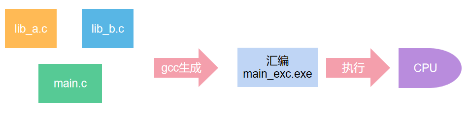
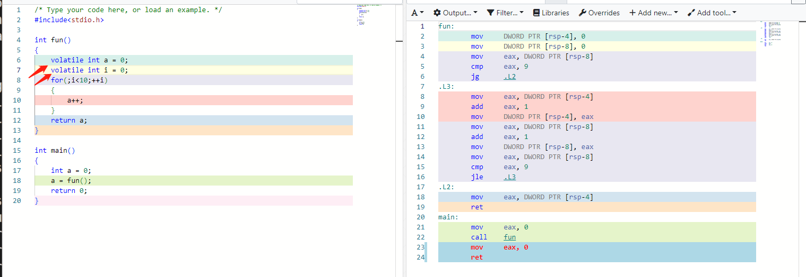
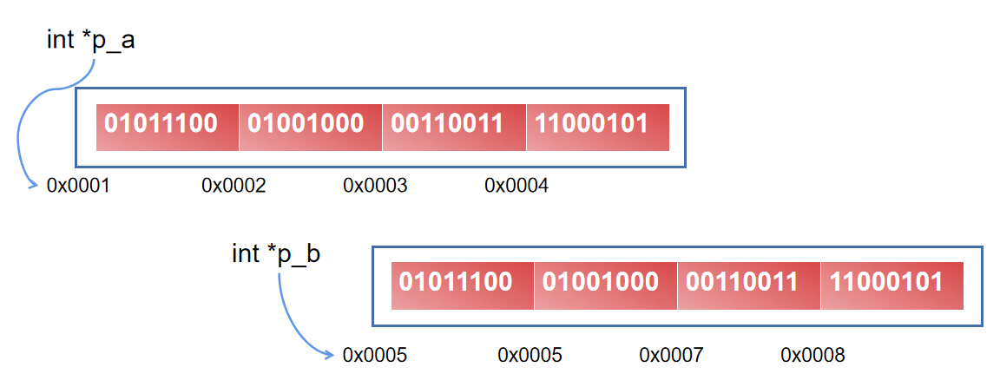

# C语言

## 一、从C语言->机器语言（编译&链接）


<center>C程序具体过程</center>

1.预编译:

删除注释；

宏替换；

预编译指令:#include #if #elif #endif；

2.编译:

词法，语法，语义的解析；

代码优化；

符号汇总(数据和函数名会生成符号)

3.汇编:

将汇编指令转化为二进制；

生成各个section；

生成符号表

4.链接:

合并各个section，调整段大小及段的起始位置，合并符号表，进行符号解析。


<center>编译与链接简化</center>

**c语言到机器可理解语言的过程简单可分为两步：**

 1. 编译 
 
	 编译器(gcc)将用户写好的.c文件编译（预编译、编译、汇编）成汇编指令文件.o。

 2. 链接

	 连接器ld将汇编指令文件.o与工程依赖的第三方库——静态库.a、动态库.so链接到一起，最终才生成可执行程序。

## 二、编译&链接工具——gcc、make、cmake


<center>一个简单的c工程</center>


<!-- tabs:start -->

#### **exec_start.c**

```c
#include <stdio.h>
#include "liba/a.h"
#include "libb/b.h"

// extern int a_veriable;

int main()
{
	printf("a_variable:%d\n"，a_variable);
	printf("b_variable:%d\n"，b_variable);
}
```

#### **liba/a.h**

```c
//a.h
#ifndef A_H
#define A_H

#ifdef __cplusplus
extern "C" {
#endif

extern int a_variable;

#ifdef __cplusplus
}
#endif

#endif /* HEAd_H */
```

#### **liba/a.c**

```c
#include "a.h"

int a_variable = 10;

```

#### **libb/b.h**

```c
//b.h
#ifndef B_H
#define B_H

#ifdef __cplusplus
extern "C" {
#endif

extern int b_variable;

#ifdef __cplusplus
}
#endif

#endif /* HEAd_H */
```

#### **libb/b.c**

```c
#include "b.h"

int b_variable = 100;
```

<!-- tabs:end -->


<center>这个简单的c工程生成可执行程序的过程</center>


为了避免每次都输入许多命令，Makefile(make)出现了。

#### ** Makefile  **

```makefile
# 定义编译器
CC = gcc
# 定义编译器标志，包括警告和调试信息
CFLAGS = -Wall -Wextra -g
# 源代码目录
SRCDIR = .
# 第一个库的源代码目录
LIBADIR = liba
# 第二个库的源代码目录
LIBBDIR = libb

# 默认目标，生成可执行文件mainexc
all: mainexc

# 生成可执行文件mainexc，依赖于a.o、b.o和main.o目标
mainexc: a.o b.o main.o
	$(CC) $(CFLAGS) a.o b.o main.o -o mainexc

# 生成a.o目标，将liba目录下的a.c编译成目标文件
a.o: $(LIBADIR)/a.c
	$(CC) $(CFLAGS) -c $< -o $@

# 生成b.o目标，将libb目录下的b.c编译成目标文件
b.o: $(LIBBDIR)/b.c
	$(CC) $(CFLAGS) -c $< -o $@

# 生成main.o目标，将src目录下的exec_start.c编译成目标文件
main.o: $(SRCDIR)/exec_start.c
	$(CC) $(CFLAGS) -c $< -o $@

# 清理生成的目标文件和可执行文件mainexc
clean:
	rm -f *.o mainexc

```


<center>一行命令解决</center>


进一步简化编译流程，cmake出现了。


#### ** CMakeLists.txt  **

```c
cmake_minimum_required(VERSION 3.10)

# 设置项目名称
project(c_demo)

# 添加可执行文件
add_executable(mainexc 
    exec_start.c 
    liba/a.c 
    libb/b.c
)

# 添加头文件搜索路径
include_directories(liba libb)

```


<center>cmake操作</center>


## 三、编译与优化(Release or Debug)——On

<center>CAM工程里的相关操作</center>

· **关于优化On**

<center>程序编译并被CPU执行</center>

但是在程序实际被生成时，由于为了优化程序运行速度，编译器会分析代码逻辑，在最终生成的汇编指令上进行优化。

```c
#include<stdio.h>

int fun()
{
    int a = 0;
    int i = 0;
    for(;i<10;++i)
    {
        a++;
    }
    return a;
}

int main()
{
    int a = 0;
    a = fun();
    return 0;
}

```

在这个c语言代码中我们真的想让a循环++10次来得到a的值。


<center>代码及对应的汇编指令-O0优化</center>


<center>代码及对应的汇编指令-O1优化</center>


<center>代码及对应的汇编指令-O2优化</center>


**编译器屏障-compiler barrier**


<center>volatile 阻止了O1变量优化</center>


· **关于Release or Debug**

&nbsp;&nbsp;&nbsp;&nbsp;在开发程序时，为了比较方便的找出问题调试代码，程序编译采用Debug模式，编译的程序中是包含源码信息的，可以通过打断点来调试程序；将程序交付给客户使用时，出于保密性与安全性，程序采用Release方式编译生成，客户拿到的只有编译好的程序，不含源码信息，此外Release方式一般默认采用较高级别的优化来加快程序运行速度。


<center>Debug 编译</center>


<center>通过gdbtui -q 调试debug模式下的程序</center>


## ~~四、C语言数据的内存位置-栈、堆、全局、局部、静态、动态~~

## 五、一切变量皆内存


<center>4个字节的整数int32</center>

C语言中内存地址的编号是以字节为单位的


<center>变量、地址与字节</center>



<center>变量a、b的指针</center>

**Question:** p_b - p_a = ?

**Answer:**

<!-- tabs:start -->

#### **1**
```
1
```
#### **other**
在C语言中，指针的加减遵循以下规则：

1. **指针的加法**：对指针加上一个整数值`i`，结果是指针向后移动了`i`个元素的位置(移动了`i*sizeof(type)`字节数)。指针的类型决定了移动的步长，即指针所指向的数据类型的大小。

2. **指针的减法**：对指针减去一个整数值，结果是指针向前移动了若干个元素的位置。指针的类型决定了移动的步长，即指针所指向的数据类型的大小。

3. **指针之间的减法**：可以对两个指针进行减法运算，其结果是两个指针之间相差的元素个数，而不是它们的地址差值。

&nbsp;&nbsp;&nbsp;&nbsp;要特别注意的是，进行指针运算时，必须确保指针指向的内存位置是合法的，否则可能导致未定义行为或错误。以下是一个简单的示例来演示指针的加减运算：

```c
#include <stdio.h>

int main() 
{
    int arr[] = {10, 20, 30, 40, 50};
    int *ptr = arr; // ptr指向数组的第一个元素

    printf("ptr指向的值：%d\n", *ptr); // 输出：10

    // 指针加法
    ptr = ptr + 2; // ptr移动两个元素位置
    printf("ptr指向的值：%d\n", *ptr); // 输出：30

    // 指针减法
    ptr = ptr - 1; // ptr向前移动一个元素位置
    printf("ptr指向的值：%d\n", *ptr); // 输出：20

    // 指针之间的减法
    int *ptr2 = arr + 4; // ptr2指向数组的最后一个元素
    int diff = ptr2 - ptr; // 计算ptr2和ptr之间的元素个数
    printf("指针之间的元素个数：%d\n", diff); // 输出：2

    return 0;
}
```

&nbsp;&nbsp;&nbsp;&nbsp;在这个示例中，我们声明了一个整型数组`arr`，并创建一个指向数组第一个元素的指针`ptr`。然后，我们对指针`ptr`进行加法和减法运算，演示了指针的移动。最后，我们对两个指针`ptr`和`ptr2`进行减法运算，计算它们之间的元素个数，即数组中相差的元素个数。

<!-- tabs:end -->

**Question:** 有一个长度为1000的float数组(滤波后的信号)，我们想把它转换成长度为1000的整数数组(加速计算)，如何做？（在FTU/故指）

**Answer:**

<!-- tabs:start -->

#### **容易想到的**
```c
float sig_f[1000] = {0.};

int main()
{
    int sig_int[1000];
    int i = 0;
    for(;i<1000;++i)
    {
        sig_int[i] = (int)sig_f[i];
    }
}


```

#### **优化方案**
```c
// 节省了1000*4字节的内存
float sig_f[1000] = {0.};

int main()
{
    int i = 0;
    int *p_sig_int = sig_f;
    for(;i<1000;++i)
    {
        p_sig_int[i] = (int)sig_f[i];
    }
}

```

<!-- tabs:end -->


**Question:** 有一个长度为1000的int数组，我们想把它转换成长度为10*100的整数数组，如何做？（在FTU/故指）

**Answer:**?

## 六、注意事项

### 1.一行代码只实现一个运算功能
```c
int i = 0;
int a[100];
for(;i<100;)
{
    a[i++] = i;
}
```

&nbsp;&nbsp;&nbsp;&nbsp;这段代码中存在未定义行为。

&nbsp;&nbsp;&nbsp;&nbsp;在这段代码中，`i` 的初始值为0，然后在循环中，我们将 `i` 的值赋给 `a[i]`，之后再递增 `i`。这涉及到了后缀递增和赋值运算符。具体来说，后缀递增操作会先返回 `i` 的值，然后再将 `i` 递增。

&nbsp;&nbsp;&nbsp;&nbsp;在这里，我们在赋值 `a[i++] = i` 的表达式中，既对 `i` 进行了读操作（用于赋值），又对 `i` 进行了写操作（后缀递增）。C 语言对于同一个变量在同一个表达式中同时进行读写操作是未定义的行为。因此，这段代码会导致未定义行为。

&nbsp;&nbsp;&nbsp;&nbsp;要避免这种未定义行为，可以修改代码，以确保在同一表达式中不同时进行读写操作，例如使用前缀递增运算符：

```c
int i = 0;
int a[100];
for (; i < 100; ) 
{
    a[i] = ++i;
}
```

或者更清晰的写法：

```c
int a[100];
for (int i = 0; i < 100; i++) 
{
    a[i] = i + 1;
}
```

这样修改后，代码不再存在未定义行为。

### 2.数值提升

&nbsp;&nbsp;&nbsp;&nbsp;说明：当进行数据类型强制转换时，其数据的意义、转换后的取值等都有可能发生变化，而这些细节若考虑不周，就很有可能留下隐患。

**基本的数据类型转换规则：**

&nbsp;&nbsp;&nbsp;&nbsp;当出现在表达式中时，有符号和无符号的char和short类型都将自动转换为int（32位系统）[数值提升]。
    示例：

```c
uint8_t port = 0x5aU;
uint8_t master_ns;
master_ns= (~port) >> 0x4;
```

&nbsp;&nbsp;&nbsp;&nbsp;在此例子中，如果不了解表达式中的类型提升，认为运算过程中*port*一直是uint8\_t类型的, \~*port* 的结果为0xa5, 0xa5\>\>4结果为0x0a，这是我们的预期结果，但是由于在运算过程中，*port*被提升成了int类型, \~ *port*结果为0xffffffa5, 0xffffffa5\>\>4结果为0x0ffffffa，赋值给master_ns，发生截断，master_ns = 0xfa，跟我们预期结果不符，应做如下修改：

```c
uint8_t port = 0x5aU;
uint8_t master_ns;
master_ns= (uint8_t)(~ port) >> 0x4;
```

### 3.缓冲区溢出-未初始化变量

&nbsp;&nbsp;&nbsp;&nbsp;说明：对数组或缓冲区的写入操作超过其边界，导致覆盖其他内存区域。

&nbsp;&nbsp;&nbsp;&nbsp;说明：使用未初始化的变量可能导致程序逻辑错误和未定义行为。需要在使用变量之前对其进行初始化。

<!-- tabs:start -->

#### **越界与未初始化**

```c
#include <stdio.h>

int main() 
{
    int arr[5];
    int *ptr = arr;
    
    // 超出数组边界写入
    for (int i = 0; i <= 5; i++) 
    {
        ptr[i] = i;
    }
    
    // 访问未初始化的内存
    int uninitialized;
    printf("%d\n", uninitialized);
    
    return 0;
}
```
#### **越界与未初始化2**

```c
int main() 
{
    int arr[5];
    arr[-1] = 10;
    return 0;
}
```


<!-- tabs:end -->

### 4.传值 or 传指针

下面是一个传值与传指针的C语言例子，以及它们的区别：

```c
#include <stdio.h>

// 传值
void passByValue(int x) 
{
    x = x * 2;
}

// 传指针
void passByPointer(int *ptr) 
{
    *ptr = *ptr * 2;
}

int main() 
{
    int num1 = 10;
    int num2 = 10;

    printf("传值前的num1的值：%d\n", num1);
    passByValue(num1);
    printf("传值后的num1的值：%d\n", num1);

    printf("传指针前的num2的值：%d\n", num2);
    passByPointer(&num2);
    printf("传指针后的num2的值：%d\n", num2);

    return 0;
}
```

输出结果为：

```
传值前的num1的值：10
传值后的num1的值：10
传指针前的num2的值：10
传指针后的num2的值：20
```

在这个例子中，我们定义了两个函数`passByValue`和`passByPointer`，分别用于传值和传指针。

**传值**：
在传值调用中，函数的参数被复制给函数的形参。这意味着函数内部对形参的修改不会影响传入的实际参数。在`passByValue`函数中，`x`是形参，当我们调用`passByValue(num1)`时，`num1`的值被复制到`x`，然后在函数内部对`x`的修改不会影响到`num1`本身，因此`num1`的值保持不变。

**传指针**：
在传指针调用中，函数的参数是一个指向实际参数地址的指针。这意味着函数内部对指针所指向的值的修改会影响到实际参数。在`passByPointer`函数中，`ptr`是形参，当我们调用`passByPointer(&num2)`时，传入的是`num2`的地址，而不是值本身。因此，函数内部对`*ptr`的修改会直接影响到`num2`的值。

**区别**：
传值是将实际参数的值复制给函数的形参，对形参的修改不会影响到实际参数。传指针是将实际参数的地址传递给函数的形参，函数内部对指针所指向的值的修改会影响到实际参数。使用传指针可以在函数内部对实际参数进行修改，从而实现对外部变量的间接操作，而传值只是对参数的副本进行操作，不会影响到原始变量。在传递大型结构体或数组时，传指针可以避免复制大量数据，从而提高性能。但需要小心传指针时的空指针和野指针问题，以避免访问非法内存。

### 5.警惕多重循环

下面是一个简单的二重循环的C语言代码示例：


<!-- tabs:start -->

#### **?**

```c
#include <stdio.h>

int main() {
    int rows = 3;
    int columns = 4;

    // 二重循环遍历二维数组
    for (int i = 0; i < rows; i++) {
        for (int j = 0; j < columns; i++) {
            printf("行：%d 列：%d\n", i, j);
        }
    }

    return 0;
}
```

#### **!**

```c
#include <stdio.h>

int main() {
    int rows = 3;
    int columns = 4;

    // 二重循环遍历二维数组
    for (int row_i = 0; row_i < rows; row_i++) {
        for (int col_j = 0; col_j < columns; col_j++) {
            printf("行：%d 列：%d\n", row_i, col_j);
        }
    }

    return 0;
}
```

<!-- tabs:end -->


&nbsp;&nbsp;&nbsp;&nbsp;在这个例子中，我们使用了两个嵌套的循环：外层循环控制行数，内层循环控制列数。通过这样的二重循环结构，我们可以遍历一个二维数组中的所有元素，或者执行任何需要在二维网格上进行迭代的操作。

### 6.警惕数值溢出

&nbsp;&nbsp;&nbsp;&nbsp;在C语言中，`uint16_t`是一个无符号16位整数类型，它的取值范围是0到65535（2^16 - 1）。如果在操作`uint16_t`类型的变量时，结果超过了这个范围，就会发生数值溢出。

以下是一个导致`uint16_t`数值溢出的例子：

```c
#include <stdio.h>

// 使用 typedef 定义 u_int16 类型
typedef unsigned short u_int16;

int main() 
{
    u_int16 num = 65530; // 最大值是 65535

    printf("初始值：%u\n", num);

    num = num + 10; // 加上 10，超过了最大值 65535

    printf("溢出后的值：%u\n", num);

    return 0;
}

```

输出结果为：

```
初始值：65530
溢出后的值：4
```

&nbsp;&nbsp;&nbsp;&nbsp;在这个例子中，`num`的初始值为65530，然后加上10，结果超过了`uint16_t`的最大值65535。由于`uint16_t`是无符号整数类型，数值溢出后会从0重新开始。所以，`65530 + 10`的结果等于4，而不是65540，因为4是65540对2^16取模后的值。

&nbsp;&nbsp;&nbsp;&nbsp;在实际编程中，需要特别注意数值溢出的情况，尤其是在处理无符号整数类型时（AD值求有效值），确保操作不会超出其范围，避免出现意外的结果。

### 7.数值运算

&nbsp;&nbsp;&nbsp;&nbsp;当两个整数相除时，C语言中的除法操作会将结果截断为整数。这意味着小数部分将被丢弃，只保留整数部分作为结果。下面是一个简单的C语言整数相除的例子：

```c
#include <stdio.h>

int main() {
    int dividend = 17; // 被除数
    int divisor = 5;   // 除数：不为0
    int result = dividend / divisor;

    printf("结果: %d\n", result);

    return 0;
}
```

在上述例子中，被除数是17，除数是5。它们相除的结果是3，因为17除以5等于3余2，但由于整数除法的特性，只保留了整数部分，即3。


## 七、Q&A

