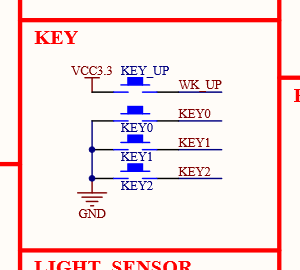
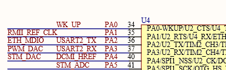

# **STM 32入门**

## **1.基础前置知识**

### **1.1&nbsp;&nbsp;点亮一颗LED灯**

基本步骤

- 使能所需外设
- 配置外设的工作模式
- 使用外设

<p align="center">
        
        <br>
       LED 链接端口
</p>

<p align="center">
        
        <br>
       LED 链接GPIO——PF9,GPIOF的第九位
</p>


```c
/*
#define RCC_AHB1ENR (volatile unsigned int *)(0x40023800 + 0x30)
#define GPIOF_MODER (volatile unsigned int *)(0x40021400 + 0x00)
#define GPIOF_ODR   (volatile unsigned int *)(0x40021400 + 0x14)
*/
volatile unsigned int * RCC_AHB1ENR =  (volatile unsigned int *)(0x40023800 + 0x30);
volatile unsigned int * GPIOF_MODER =  (volatile unsigned int *)(0x40021400 + 0x00);
volatile unsigned int * GPIOF_ODR   =  (volatile unsigned int *)(0x40021400 + 0x14);

int main()
{
    //使能PF模块的时钟，这里的RCC是指复位、时钟、控制
    *RCC_AHB1ENR |= 1<<5;//使能GPIO_F端口，如下图所示它在寄存器第5位。
    // 设置PF9的功能为输出，工作模式配置
    *GPIOF_MODER &= ~(3<<(2*9));//3为11，左移18位并取反‘与’，对相应位置置零。
    *GPIOF_MODER |= 1<<(2*9);//1为01，左移18位并 ‘或’，对相应位置置1，工作模式设为输出。
    //设置PF9输出低电平，点亮LED灯
    *GPIOF_ODR &= ~(1<<9);

    while(1);
    return 0;
}
```
<p align="center">
        
        <br>
        在GPIO_F所在总线寄存器上使能GPIO_F
</p>

<p align="center">
        
        <br>
       配置GPIO_F工作模式
</p>

<p align="center">
        
        <br>
       配置GPIO_F输出
</p>

<p align="center">
        
        <br>
       寄存器起始位置映射
</p>


### **1.2&nbsp;&nbsp;寄存器配置中的位运算**

主要是六种运算符：
- \&  : 与
- \|  : 或
- \^  : 异或
- \~  : 反
- << : 左移
- \>> : 右移

运算代码：
```c
// 变量声明
u_int8 a = 1;//0000 0001
u_int8 b = 3;//0000 0011
//运算
(u_int8) a&b == (u_int8)1;//0000 0001
(u_int8) a|b == (u_int8)3;//0000 0011
(u_int8) a^b == (u_int8)2;//0000 0010
(u_int8) ~b == (u_int8)0xFC;//1111 1100
(u_int8) a<<2 == (u_int8)4;//0000 0100
(u_int8) b>>1 == (u_int8)1;//0000 0001
```

### **1.3&nbsp;&nbsp;寄存器的定义过程分析**

- **寄存器地址**

<p align="center">
        
</p>

- **寄存器定义过程分析**
<p align="center">
        
</p>

<p align="center">
        
</p>

<p align="center">
        
</p>

### **1.4&nbsp;&nbsp;按键控制蜂鸣器demo**

<p align="center">
        
        <br>
       按键连接
</p>

<p align="center">
        
        <br>
       对应GPIO_A0
</p>

因此，要配置GPIO A与F的寄存器。
全局定义：
```c
volatile unsigned int * RCC_AHB1ENR =  (volatile unsigned int *)(0x40023800 + 0x30);
volatile unsigned int * GPIOA_MODER =  (volatile unsigned int *)(0x40020000 + 0x00);
volatile unsigned int * GPIOA_PUPDR =  (volatile unsigned int *)(0x40020000 + 0x0C);
volatile unsigned int * GPIOA_IDR =    (volatile unsigned int *)(0x40020000 + 0x10);
volatile unsigned int * GPIOF_MODER =  (volatile unsigned int *)(0x40021400 + 0x00);
volatile unsigned int * GPIOF_ODR   =  (volatile unsigned int *)(0x40021400 + 0x14);
```
首先，使能所在总线上的时钟，
```c
*RCC_AHB1ENR |= 1<<5;//GPIO F on AHB1
*RCC_AHB1ENR |= 1;//GPIO A on AHB1
```
配置工作模式及上下拉电阻，
```c
*GPIOA_MODER &= ~(3);//set GPIO A0 in
*GPIOA_PUPDR &= ~(3);//clear default R
*GPIOA_PUPDR |= ~(1);//set down R
*GPIOF_MODER &= ~(15<<(2*8));//clear GPIO F moder
*GPIOF_MODER |= 5<<(2*8);//set GPIO F moder
```
初始化一下并循环检查，
```c
unsigned int mask = 1;
*GPIOF_ODR &= ~(3<<8);// set GPIO F out_data_re
while (1)
{
    /* USER CODE END WHILE */
    HAL_Delay(100);
    if((*GPIOA_IDR & mask) == mask)
    {
        *GPIOF_ODR |= (3<<8);
    }
    else
    {
        *GPIOF_ODR &= ~(3<<8);
    }
    /* USER CODE BEGIN 3 */
}
```
实现了按下按键蜂鸣器响且LED灯灭。

### **1.5&nbsp;&nbsp;在嵌入式中一般性的定义**
数据类型，
```c
typedef unsigned char u_int8;//一字节，8位无符号整数
typedef unsigned short int u_int16;//两字节，16位无符号整数
typedef unsigned int u_int32;//四字节，32位无符号整数
typedef unsigned long int u_int32;//四字节，32位无符号整数
typedef unsigned long long int u_int64;//八字节，64位无符号整数
```


## **附录:嵌入式学习常见缩写**

### **常规：**

ARM：Advanced RISC Machine

AAPCS：ARM Architecture Process call standard ARM体系结构过程调用标准

RISC： Reduced Instruction Set Computer 精简指令集计算机

RTOS：Real Time Operating System 实时操作系统

DMA：Direct Memory Access 存储器直接访问

EXTI: External Interrupts 外部中断

FSMC: Flexible static memory controller 可变静态存储控制器

FPB：flash patch and breakpoint FLASH 转换及断电单元

HSE：Hign speed external

HSI: High speed internal

LSE: Low Speed external

LSI: Low Speed Internal

LSU: load store unit 存取单元

PFU: prefetch unit 预取单元

DPU：Dataflow Processing Unit，数据流处理单元

FPU：Floating Processing Unit，浮点计算单元

ISR：Interrupt Service Routines，中断服务程序

NMI：Nonmaskable Interrupt，不可屏蔽中断

NVIC：Nested Vectored Interrupt Controller，嵌套向量中断控制器

MPU：Memory Protection Unit，内存保护单元

MMU：Memory Management Unit，内存管理单元

MIPS:million instructions per second 每秒能执行的百万条指令的条数

RCC：Reset and clock control 复位和时钟控制

RTC: Real-Time Clock 实时时钟

IWDG: independent watchdog 独立看门狗

WWDG：Window watchdog 窗口看门狗

TIM：timer 定时器

GAL：generic array logic 通用阵列逻辑

PAL：programmable array logic 可编程阵列逻辑

ASIC：Application Specific Integrated Circuit 专用集成电路

FPGA：Field－Programmable Gate Array 现场可编程门阵列

CPLD：Complex Programmable Logic Device 可编程逻辑器件

IAP：即 in-application programming，IAP is the ability to re-program the Flash memory of a microcontroller while the user program is running.

ICP：即 in-circuit programming，ICP is the ability to program the Flash memory of a microcontroller using the JTAG protocol, the SWD protocol or the bootloader while the device is mounted on the user application board.

Option bytes：product configuration bits stored in the Flash memory.

ITCM：Instruction Tighly Coupled Memory.

DTCM：Data Tighly Coupled Memory.

### **端口：**

AFIO：alternate function IO 复用IO端口

GPIO：general purpose input/output 通用IO端口

IOP（A-G）:IO port A - IO port G (例如：IOPA:IO port A)

CAN：Controller area network 控制器局域网

FLITF：The Flash memory interface 闪存存储器接口

I2C： Inter-integrated circuit 微集成电路

IIS： integrate interface of sound 集成音频接口

JTAG：joint test action group 联合测试行动小组

SPI：Serial Peripheral Interface 串行外围设备接口

SDIO: SD I/O

UART: Universal Synchr./Asynch. Receiver Transmitter 通用同步/异步接收/发送装置

USB: Universal Serial Bus 通用串行总线

### **寄存器相关：**

CPSP： Current Program Status Register 当c前程序状态寄存器

SPSP： saved program status register 程序状态备份寄存器

CSR：clock control/status register 时钟控制状态寄存器

LR： link register 链接寄存器

SP： stack pointer 堆栈指针

MSP: main stack pointer 主堆栈指针

PSP：process stack pointer 进程堆栈指针

PC： program counter 程序计数器

### **调试相关：**

ICE：in circuit emulator 在线仿真

ICE Breaker 嵌入式在线仿真单元

DBG：debug 调试

IDE：integrated development environment 集成开发环境

DWT: data watchpoint and trace 数据观测与跟踪单元

ITM: instrumentation trace macrocell测量跟踪单元

ETM： embedded trace macrocell嵌入式追踪宏单元

TPIU：trace port interface unit 跟踪端口接口单元

TAP： test access port 测试访问端口

DAP: debug access prot调试访问端口

TP: trace port 跟踪端口

DP：debug port 调试端口

SWJ-DP: serial wire JTAG debug port 串行-JTAG 调试接口

SW-DP: serial wire debug port 串行调试接口

JTAG-DP：JTAG debug port JTAG 调试接口

### **系统类：**

IRQ： interrupt request 中断请求

FIQ： fast interrupt request 快速中断请求

SW：software 软件

SWI： software interrupt 软中断

RO:read only 只读（部分）

RW:read write 读写（部分）

ZI:zero initial 零初始化（部分）

BSS：Block Started by Symbol 以符号开始的块（未初始化数据段）

### **总线：**

Bus Matrix 总线矩阵

Bus Splitter 总线分割

AHB-AP：advanced High-preformance Bus-access port

APB:advanced peripheral busAPB1: low speed APB

APB2: high speed APB

PPB： Private Peripheral Bus 专用外设总线

AHB：advanced high-performance bus.

AHBS：AHB Slave bus.

AXIM：AXI master bus.

### **杂类：**
ALU：Arithmetic Logical Unit，算术逻辑单元

CLZ： count leading zero，前导零计数（指令）

SIMD： single instruction stream multiple data stream，单指令流，多数据流

VFP： vector floating point，矢量浮点运算

DFU：Device Firmware Upgrade，设备固件升级

ICU：Instruction Cache Unit，指令缓冲存储单元

DCU：Data Cache Unit，数据缓冲存储单元

### **词汇/词组：**

Big Endian 大端存储模式

Little Endian 小端存储模式

context switch 任务切换（上下文切换）（CPU寄存器内容的切换）

task switch 任务切换

literal pool 数据缓冲池

### **词汇类/单词：**

arbitration 仲裁

access 访问

assembler 汇编器

disassembly 反汇编

binutils连接器

bit-banding 位段（技术）

bit-band alias 位段别名

bit-band region 位段区域

banked 分组

buffer 缓存

ceramic 陶瓷

fetch 取指

decode 译码

execute 执行

Harvard 哈佛（架构）

handler 处理者，句柄

heap 堆

stack 栈

latency 延时

load (LDR) 加载（存储器内容加载到寄存器Rn）

store (STR) 存储（寄存器Rn内容存储到存储器）

Loader 装载器

optimization 优化

process 进程/过程

thread 线程

prescaler预分频器

prefetch预读/预取指

perform 执行

pre-emption 抢占

tail-chaining 尾链

late-arriving 迟到

resonator 共振器

### **指令相关：**

instructions 指令

pseudo-instruction 伪指令

directive 伪操作

comments 注释

FA full ascending 满栈递增（方式）

EA empty ascending 空栈递增（方式）

FD full desending满栈递减（方式）

ED empty desending空栈递减（方式）
