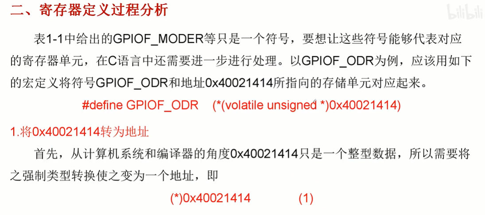

# **STM 32入门**

## **1.基础前置知识**

### **1.1&nbsp;&nbsp;点亮一颗LED灯**

基本步骤

- 使能所需外设
- 配置外设的工作模式
- 使用外设

<p align="center">
        
        <br>
       LED 链接端口
</p>

<p align="center">
        
        <br>
       LED 链接GPIO——PF9,GPIOF的第九位
</p>


```clike
/*
#define RCC_AHB1ENR (volatile unsigned int *)(0x40023800 + 0x30)
#define GPIOF_MODER (volatile unsigned int *)(0x40021400 + 0x00)
#define GPIOF_ODR   (volatile unsigned int *)(0x40021400 + 0x14)
*/
volatile unsigned int * RCC_AHB1ENR =  (volatile unsigned int *)(0x40023800 + 0x30);
volatile unsigned int * GPIOF_MODER =  (volatile unsigned int *)(0x40021400 + 0x00);
volatile unsigned int * GPIOF_ODR   =  (volatile unsigned int *)(0x40021400 + 0x14);

int main()
{
    //使能PF模块的时钟，这里的RCC是指复位、时钟、控制
    *RCC_AHB1ENR |= 1<<5;//使能GPIO_F端口，如下图所示它在寄存器第5位。
    // 设置PF9的功能为输出，工作模式配置
    *GPIOF_MODER &= ~(3<<(2*9));//3为11，左移18位并取反‘与’，对相应位置置零。
    *GPIOF_MODER |= 1<<(2*9);//1为01，左移18位并 ‘或’，对相应位置置1，工作模式设为输出。
    //设置PF9输出低电平，点亮LED灯
    *GPIOF_ODR &= ~(1<<9);

    while(1);
    return 0;
}
```
<p align="center">
        
        <br>
        在GPIO_F所在总线寄存器上使能GPIO_F
</p>

<p align="center">
        
        <br>
       配置GPIO_F工作模式
</p>

<p align="center">
        
        <br>
       配置GPIO_F输出
</p>

<p align="center">
        
        <br>
       寄存器起始位置映射
</p>


### **1.2&nbsp;&nbsp;寄存器配置中的位运算**

主要是六种运算符：
- \&  : 与
- \|  : 或
- \^  : 异或
- \~  : 反
- << : 左移
- \>> : 右移

运算代码：
```clike
// 变量声明
u_int8 a = 1;//0000 0001
u_int8 b = 3;//0000 0011
//运算
(u_int8) a&b == (u_int8)1;//0000 0001
(u_int8) a|b == (u_int8)3;//0000 0011
(u_int8) a^b == (u_int8)2;//0000 0010
(u_int8) ~b == (u_int8)0xFC;//1111 1100
(u_int8) a<<2 == (u_int8)4;//0000 0100
(u_int8) b>>1 == (u_int8)1;//0000 0001
```

### **1.3&nbsp;&nbsp;寄存器的定义过程分析**

- **寄存器地址**

<p align="center">
        
</p>

- **寄存器定义过程分析**
<p align="center">
        
</p>

<p align="center">
        
</p>

<p align="center">
        
</p>